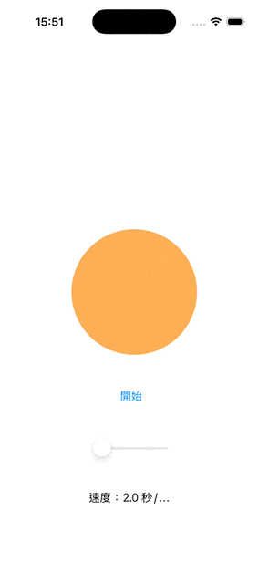

# #1-1 app gif

## iOS Breathing Animation App

This project is an iOS app written in Swift using UIKit. It features a simple breathing animation to help users relax and focus on their breathing.

### Features
- Animated orange circle that expands and contracts to simulate breathing
- Adjustable breathing speed using a slider (2–8 seconds per breath)
- Start/Stop button to control the animation
- Clean and simple UI

### Screenshots

### How It Works
- The circle expands and contracts smoothly using UIView animation.
- The speed slider lets users set the duration of each breath cycle.
- The start button toggles the animation on and off.

### Getting Started
1. Open `hw1_gif.xcodeproj` in Xcode.
2. Build and run on a simulator or device (iOS 13+).

### File Structure
- `ViewController.swift`: Main logic for animation and UI controls
- `Main.storyboard`: UI layout
- `Assets.xcassets`: App icons and colors
- `hw1_gif.gif`: Demo animation

### Author
- demi
